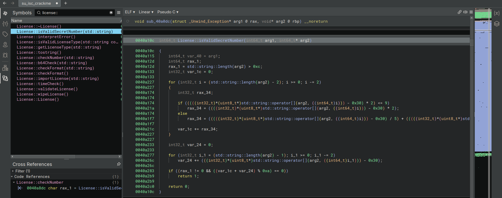

# ISC_Crackme Walkthrough

This simple license validator is designed to expose the user to a revere engineering workflow, using Binary Ninja to
reverse the license format and validation to bypass the license check and generate a license that the program thinks is
valid.

### The goal:

Generate your own license that will be accepted by the program.
Your license should result in valid values for all the fields under `License Details`:


### Running the program:

When the program starts, you should see a UI that looks similar to this:


Pressing "Check License" yields an error message, `Invalid number of fields - The license needs more information`. While
not the most useful, that error message lets us know that the license contains several fields, each with some sort of
information.

### Loading in Binary Ninja:

[Binary Ninja](https://binary.ninja/) is a reverse engineering platform that allows us to disassemble and analyze the
program.
We will use it to reverse engineer the license format and validation to generate a valid license.
After loading the program into Binja, set the view mode to "Pseudo C" at the top of the disassembly view to make the
disassembly easier to read.
The function names can be seen in the left top panel, under "Symbols", and the strings can be found by clicking on the
double-quote icon in the column to the right of the disassembly view.

_Note: Details in the screenshots will be different on different builds of the program. The view in the screenshots is
the Linux build of the program_

#### Strings: The low-hanging fruit

We can search the strings panel for the error message we saw earlier,
`Invalid number of fields - The license needs more information`, to try and find the function that causes it.

There will be one result, and double-clicking on it will take us to the strings table. While not the validation function
that we were hoping for, the strings table is just as useful.


The strings table is mostly in order, and the possible error messages are towards the bottom of the screenshot:
Here are the error messages:

- `License Successfully Verified!`
- `Invalid format`
- `Invalid number of fields - The license needs more information`
- `Invalid secret number`
- `Invalid licensee email address`
- `License hasn't begun yet`
- `License expired`
- `Invalid license dates. Time travel is prohibited`
- `Invalid license type`
- `Unknown error`

The error messages let us know the following about the format of the license:

- A secret number is required
- An email address is required
- The license has a start date
- The license has an expiration date
- The license has a type
- The license is looking for a specific format

Therefore, we can assume that the license has 5 fields:

1. Secret number
2. Email address
3. Start date
4. Expiration date
5. License type

#### Setting types

While in the string table, I will set the format of `data_43cdfd` to C string.
Because the '0x2C' byte is in the string table, it is most likely a C string.


After the type has been set to a C string, we can see that the string is a comma.


#### Reading Regular Expressions

Also in the string table are 2 regular expressions,


The first regex will match any string composed of blocks of 4 Alphanumeric characters, terminated by either 2 or 1 `=`
characters. This is the format of a base64 string, so it can be renamed "base64regex" by right-clicking on the data
block name and selecting "Rename".

> Note: Base64 encoding is a common method of encoding data as text, using the characters A-Z, a-z, 0-9, and the symbols
`+` and `/`. The `=` character is used as padding at the end of the string. It is particularly useful when a programmer
> needs to encode non-printable data as printable text.

Regex #2 sill match any string consisting of a series of alphanumeric characters, followed by an `@` symbol, followed by
another series of alphanumeric characters, and ending with a `.` followed by another series of alphanumeric characters.
Therefore, this regex is likely meant to match any email addresses, and can be renamed as such.
I will also rename the comma string to "comma" for clarity.

At this point, the string table should look like this:


### Finding the format-checking function

We can search for likely function names that may be called to validate the license. While function names will often be
stripped from compiled programs, they are available in this example.

By searching 'license' in the Symbols panel, we will have a list of matching functions:


We can look at the function `License::checkFormat(std::string)` by double-clicking the function name in the symbols
list.
Near the top of the function, we can see that it calls `License::b64Check(std::string)`, then xors the result with 1.
Therefore, if the base64 check succeeds, then the variable will be set to 0.
I will rename this variable to `b64CheckResult` for clarity. Also, arg2 should be renamed to 'inputString'.

The `License::checkFormat(std::string)` function should look like this now:


###### Base64 Check

We can look at `License::b64Check(std::string)` by double-clicking the function name in the symbols list.


While there is some logic in the function, near the bottom we can see that it is checking if a string matches a regular
expression. We can select the regular expression, `"^([A-Za-z0-9+/]{4})*([A-Za-z0-9+…` and look at the
`Cross References` (xrefs) pane in the bottom left to see where it is defined. Looking at the xrefs panel, we can see
that the regex is the string we renamed to `base64regex` earlier.
Now we know for a fact that this function is checking if a string is a base64 string.

#### Back to `License::checkFormat(std::string)`

Returning to `License::checkFormat(std::string)`, we can see that the function enters an if statement
`if (b64CheckResult == 0)`, which we know means that the base64 check succeeded.

The first code executed inside the if statement is:

```
0040ab27          void var_c8;
0040ab27          b64_decode(&var_c8, inputString);
```

This snippet base64 decodes `inputString` and stores the result in `var_c8`, which will be renamed to `decodedString`.
_Note: the structure of assigning a variable of void type and immediately calling a function with that as the argument
is a common way of passing a reference to a variable. The called function will then set its result to that variable
passed in._

Scrolling down towards the bottom of the function to find the next usage of `decodedString`, we can see that it is
passed to a function `splitString`


We can see that `splitString` is called with `decodedString`, a new variable, and `0x2C` as arguments.
We can make this clearer by renaming the first argument, in my case `var_108`, to `splitString`, and by setting the
display mode of the `0x2c` to be a character constant, as is shown below:


After changing the display mode, we can see that the function is calling splitString with the decoded string and a comma
as arguments.

We can now see that the split output is used right underneath the call to `splitString` by checking to see if number of
strings in the output is not 5.

In the screenshot, the variable rax_8 will be 1 if the length of the list `splitStringOutput` is not 5, and 0 if the
length is 5.
**Therefore, we can be sure that there are 5 fields in our valid license**

If the length check succeeds (if rax_8 is 0), the function will execute a regular expression check on the first element
of the split string:

```c
0040ac3e    if (rax_8 == 0)
0040ac3e    {
0040ac60        void var_128;
0040ac60        std::basic_regex<char, std::regex_traits<char> >::basic_regex(&var_128, "^[a-zA-Z0-9._%+-]+@[a-zA-Z0-9.-]…", 0x10);
0040ac60        
0040ac98        if (std::regex_match<std::ch...har>, char, std::regex_traits<char> >(std::vector<std::string>::operator[](&splitStringOutput, 0), &var_128, 0) == 1)
0040aca1            rbx_1 = 0;
0040ac98        else
0040ac9a            rbx_1 = 4;
0040ac9a        
0040acb0        std::basic_regex<char, std::regex_traits<char> >::~basic_regex(&var_128);
0040ac3e    }
```

While it looks complex, it can be simplified relatively easily. Lines 0040ac60 are creating a regex object that checks
if a string has an @ symbol, then saves that to `var_128`
Lines 0040ac98 are checking if the first element of the split string matches the regex

> Note: `std::vector<std::string>::operator[](&splitStringOutput, 0)` is the same as calling `splitStringOutput[0]` -
> both are accessing the first element of the output of `splitString`

If the regex check succeeds, the variable `rbx_1` will be set to 0, and if it fails, it will be set to 4.

At the bottom of the function, we can see that the function returns `rbx_1`. Throughout the function, we can see that
`rbx_1` is set to different values if either the base64 check or the email check fail, but set to 0 if the checks
succeed. Therefore, we can assume that 0 is returned if checkFormat succeeds.

###### What we have learned so far:

There are 5 elements in the license: Email, Secret Number, Start Date, Expiration Date, and License Type.
The License is base64 encoded
The fields are separated by a comma
Email is the first field of the license

### Finding the rest of the fields

Currently we know that the first field is an email address, but we don't know the rest of the structure of the license.
We can look for other uses of `splitString` to try and identify other fields in the license. By searching "splitString"
in symbols, then selecting the function, we can see the xrefs below the symbols field:


While 2 of the usages are `License::checkFormat`, the other usage is `License::importLicense`. We can select that entry
in the Cross References pane to jump to that usage of splitString


The function `License::importLicense` is very dense, but we can start to understand it by renaming variables.
We see that `b64_decode` is called almost immediately and has its output set to `var_38`, so it can be renamed to
`decoded_string`
As with `License::checkFormat`, we can see that `splitString` is again called with `decoded_string` and a comma as
arguments (although as before, the comma is viewable as its hex equivalent `0x2c`).

It becomes clear that the rest of the function is going through the elements of the split license index by index, and
saving them to indices within `arg1`

> Note: Since `License` is an object, `arg1` (as decompiled from the Linux binary) is the `License` object passed to all
> member functions of the class. Therefore, indexing into `arg1` would be setting fields of a License object.

Using the rest of the function, we can start to build a picture of the data in each field of the license.

`std::string::operator=(((char*)arg1 + 0x80), std::vector<std::string>::operator[](&split_string_output, 0));`:
We know that the first field of the license is at the first index, `split_string_output[0]`, and is the email address.

`std::string::operator=(&arg1[0x14], std::vector<std::string>::operator[](&split_string_output, 1));`:
The second field of the license is a string

```c
arg1[0x1c] = std::stol(std::vector<std::string>::operator[](&split_string_output, 2), nullptr, 0xa);
arg1[0x1d] = std::stol(std::vector<std::string>::operator[](&split_string_output, 3), nullptr, 0xa);
```

`std::stol` is a function that converts a string to a long integer. Therefore, the third and fourth fields of the
license are interpreted as numbers

`std::string::operator=(&arg1[0x18], std::vector<std::string>::operator[](&split_string_output, 4));`:
The fifth and last field of the license is a string

###### What we have learned so far:

- The license is base64 encoded
- The fields are separated by a comma
- The format of the license is as follows:
    1. Email
    2. String
    3. Number
    4. Number
    5. String

- the five required fields are:
    1. Email
    2. Start Date
    3. Expiration Date
    4. Secret Number
    5. License Type

It would be unreasonable to assume that the start and end date were different data types (e.g. one being a string and
the other being a number), so we can assume that the start and end date are both numbers or both strings.

All that remains to figure out is:

- Whether the dates are stored as numbers or strings
- How the license type is stored
- How the secret number is stored

### Diversion: Looking at the error codes:

When reversing the `License::checkFormat` function, we saw that the function would return 0 if it succeeded, and 4 if
the email check failed.
It may be useful to find other error codes to try and figure out the missing fields of the license.
By returning to the string search for one of the error messages, clicking on one of the strings, for example, "Invalid
secret number", we can view the cross-references to that string.


By double-clicking on either of the cross-references that reference that error message, we are taken to
`License::License()`
The function has a list of setting ints to different values, 1-9, then setting a
`std::pair<int32, char const[some length]>`

After renaming the variables, here is the function:


This can also be interpreted as a table of error codes and their corresponding error messages:

| Error Code | Error Message                                                 |
|------------|---------------------------------------------------------------|
| 0          | License Successfully Verified!                                |
| 1          | Invalid format                                                |
| 2          | Invalid number of fields - The license needs more information |
| 3          | Invalid secret number                                         |
| 4          | Invalid licensee email address                                |
| 5          | License hasn't begun yet                                      |
| 6          | License expired                                               |
| 7          | Invalid license dates. Time travel is prohibited              |
| 8          | Invalid license type                                          |
| 9          | Unknown error                                                 |

By using the values from the table, we can begin to figure out the remaining fields of the license.

### Figuring out the date format

We will start by searching the symbols for `License::` and looking for likely functions that could tell us more about
the format of the date

The list of functions returned by the search includes `License::timeCheck()`, so we'll go there by clicking the function
name:


The first thing that the function does is get the current time using the system function, which returns a unix
timestamp. For clarity, we will rename the variable to `current_time`.

> Note: A Unix timestamp is the number of seconds that have passed since January 1, 1970. It is a common way to store
> time in programming.

The other two variables referenced in this function are `arg1 + 0xe0` and `arg1 + 0xe8`. These are likely the start and
end dates of the license, but we can't be sure which is which yet.

We can see that there are 4 possible return values from this function: 7, 5, 0, and 6. Assuming that the return values
are error codes, we can refer back to the table of error codes we made earlier.

> | Error Code | Error Message                                                 |
> |------------|---------------------------------------------------------------|
> | 0          | License Successfully Verified!                                |
> | 5          | License hasn't begun yet                                      |
> | 6          | License expired                                               |
> | 7          | Invalid license dates. Time travel is prohibited              |

Using those error codes, we can can infer that the function is checking if the current time is between the start and end
dates of the license. If the current time is before the start date, it will return 5, if it is after the end date, it
will return 6, and if the current time is between the start and end dates, it will return 0. If the start date is after
the end date, it will return 7.
Because of the data types used, we know that the dates are saved as unix timestamps in the license, and that the start
date is the first number, and the end date is the second number.

###### What we have learned so far:

The license is base64 encoded, with the 5 fields separated by commas.
The dates are unix timestamps
The discovered fields are as follows:

1. Email
2. Unknown string
3. Start Date
4. Expiration Date
5. Unknown String

All that is left is to figure out the secret number and the license type

### Constructing a partial valid license

Now that we know the format of the license, and the majority of the license fields, we can begin to construct a partial
license, and see what the program returns.

To construct the license, I will use 2 websites to generate the unix timestamps and base64 encode the license, although
anything that gets the job done is fine:

- [Epoch Converter - epochconverter.com](https://www.epochconverter.com/)
- [Base64 Encode - CyberChef](https://gchq.github.io/CyberChef/#recipe=To_Base64('A-Za-z0-9%2B/%3D'))

> Note: CyberChef is an incredibly powerful tool. The link to cyberchef pre-fills the recipe for base64 encoding, but
> you can construct your own recipes by dragging and dropping the operations you want to perform.

Start by generating the timestamps for the start and end date of the license using the epoch converter, selecting any
date in the future and any date in the past.

In the "Input" field of CyberChef, enter the license fields separated by commas according to what we know so far:

`email,unknown_string,start_date,expiration_date,unknown_string`

For example: `test@test.test,qwertyuiop,1694245945,1883634745,qwertyuiop`


After encoding the license, paste it into the license field of the program and press "Check License" to see what the
program says:


Congratulations! The email, format, and date checks have been passed, now the secretNumber check needs to be passed:

### Secret Number check:

Back to Binary Ninja, we can search for the function that checks the secret number. By searching for
`License::isValidSecretNumber` in the symbols, we can find the function that checks the secret number.


The function is very complex. While it would be possible to reverse engineer the function, we can see that it is only
ever called in a single location, by looking at the Cross References pane. By clicking on the cross-reference, we jump
to that function, `License::checkNumber`, which we see has many more references.


There are only 2 possible return values from this function: 3 and 0. Looking back to the table of error codes:

> | Error Code | Error Message                                                 |
> |------------|---------------------------------------------------------------|
> | 0          | License Successfully Verified!                                |
> | 3          | Invalid secret number                                         |

This function is likely actually in charge of checking the secret number, and is much simpler than the
`License::isValidSecretNumber` function
Still, the function calls `License::isValidSecretNumber` with the secret number as an argument, so that function is
still needed.
However, we can patch the function to not check the output of `isValidSecretNumber` and always return 0.
To do this, we will select the entire function but the return statement, right-click, and select "Patch Function",
then "Convert to NOP"
NOP stands for No Operation, and is an assembly instruction that does nothing. By converting the function to NOP, we are
effectively disabling the function, ensuring that it will always return 0.


To actually apply the changes to the binary, we will save as, then select "Save file contents only", and save the file.

Now we can run the modified program and enter the same license as before, and see how the behavior changes:


Now that the secret number is patched, the program congratulates you on patching the number check (assuming the number
check is patched successfully). However, the license type is still missing, and the "Invalid license type" error still
appears.

### License Type:

We could start by assuming that the license type is a string, and return to the string table section in Binary Ninja by
searching again for any of the error messages in the strings menu.
Returning to the strings table beneath the error messages, we see strings such as, "Professional", "Standard", and "
Trial". These are likely the possible license types. Using the same strategy as was used to construct the error code
table, we can also construct a table of license codes and types by selecting a license, then using the Cross References
to see where it is referenced.


Back in `License::License()`, we can see all of the license types and their corresponding codes, allowing the
construction of a table of the License types:

| License Code  | License Type                    |
|---------------|---------------------------------|
| `LIC_UNLIC`   | Trialv                          |
| `LIC_STD`     | Standard                        |
| `LIC_PRO`     | Professional                    |
| `LIC_PROPLUS` | Professional Plus               |
| `LIC_APPLE`   | Professional Plus Max Pro Ultra |
| `LIC_ENTR`    | Enterprise                      |

Now that we have the license types, we can construct a license with the license type included, and see if the program accepts the license:

### Valid License Construction:
We still don't know where the license type and the secret number are in the license but we can simply construct 2 licenses, one with the license type in the first unknown spot, and one with the license type in the second unknown spot.

Known Fields: `email,unknown_string,start_date,expiration_date,unknown_string`
Attempts: `email,license_type,start_date,expiration_date,secret_number` and `email,secret_number,start_date,expiration_date,license_type`
Examples: `test@test.test,LIC_UNLIC,1694245945,1883634745,qwertyuiop`, and `test@test.test,qwertyuiop,1694245945,1883634745,LIC_UNLIC`

Using CyberChef to base64 encode each of the licenses, we can try each of them in the program to see if they are accepted as valid licenses


> Note: I used the fork operator, which will cause the To Base64 operation to be performed on each of the input lines

By trial and error, we can see that the license with the license type in the first unknown spot is accepted as a valid license, and the license with the license type in the second unknown spot is not accepted.

Therefore, the correct License format is:
`email,license_type,start_date,expiration_date,secret_number`

Congratulations! At this point, you should be able to make your own license.


However, you may notice that the status text box at the top says "CRACKED", not "LICENSED", like my example at the beginning showed.

Throughout the program, I have placed checks that make check whether the program has been patched. Note that even if you provide a valid number secret number and the secret number check is patched, the program will still display "CRACKED" instead of "LICENSED".
There are several approaches you may take to getting it to display "LICENSED" (And bypassing the popup congratulating you on patching the number check):
 - Finding and patching all the checks for the patched functions
 - Reverse engineering the secret number check and generating a valid secret number
 - Reimplementing the secret number check in another language and brute-force checking for valid serial numbers
 - Patching out the checks that determine whether to display the "CRACKED" message or the "Congratulations on patching message"
 - Figuring out what algorithm I used to determine whether a secret number is valid or not (I didn't create my own algorithm)